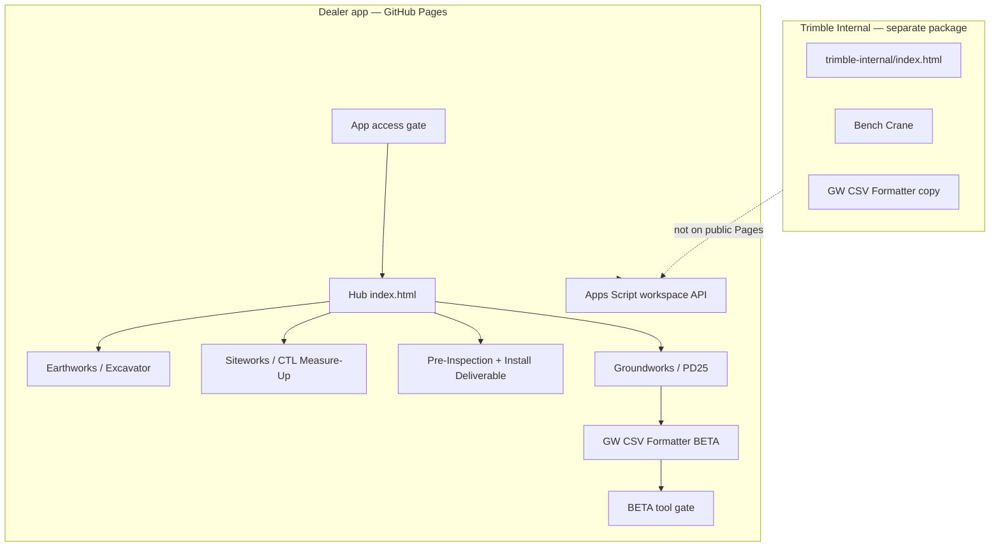

# Dealer-facing Technician Assistant

This document describes the **public dealer hub** deployed to GitHub Pages. Personnel-only tools live in [`trimble-internal/`](../trimble-internal/README.md) and must **not** ship with the dealer deploy.

**Live site:** https://justinbill-ai.github.io/trimble-technician-assistant/

---

## Architecture overview



---

## Dealer categories and tools

| Hub category | Folder | Purpose |
|--------------|--------|---------|
| **Earthworks Excavator** | `excavator/` | Tuning assistant, prestart, symptoms |
| **Siteworks Machine Guidance** | `measure-up/ctl/` | CTL measure-up calculator, PDF report |
| **Machine wear / Installation** | `pre-inspection/`, `install-deliverable/` | Wear reports and post-install photos |
| **Trimble Groundworks** | `groundworks/pd25/` | PD25 guided workflow + measure-up calculator |
| **Trimble Groundworks (BETA)** | `groundworks/csv-formatter/` | Map survey/TBC CSV columns → Groundworks pile import CSV |

---

## Shared foundation (`assets/`)

| Module | Role |
|--------|------|
| `trimble-connect.css` | Trimble Connect visual system |
| `workspace-config.js` | Apps Script endpoint, app URL, telemetry flags, `betaTools` registry |
| `workspace-api.js` | Telemetry, feedback, access + BETA access API client |
| `app-access.js` | Email + 6-digit code gate on hub; session on tool pages |
| `beta-access.js` / `beta-access.css` | Per-tool BETA gate (loaded on BETA tool pages only) |
| `hub-nav.js` | Category picker and tool drill-in |
| `landing-help.js` | Hub help modal |
| `feedback.js` | Developer feedback modal |
| `report-upload.js` | Optional Drive PDF archive |

---

## Access model (dealers)

### Main app access

1. User opens hub → **Request access** with work email.
2. **`@trimble.com`** — auto-approved; sign-in code emailed (28-day grant).
3. **Other domains** — pending until admin approves via email link; then sign-in code.
4. Tool pages trust stored session; expired/revoked users redirect to hub.

Backend: `google-workspace/Code.gs` → Sheets (`ApprovedUsers`, `AccessCodes`, `Events`).

### BETA tool access (Groundworks CSV Formatter)

BETA access is **in addition to** main app access. Users must be signed in to the Technician Assistant before the BETA gate appears.

| User | BETA flow |
|------|-----------|
| **`@trimble.com`** | Tap **Continue to BETA tool** → auto-granted (28-day grant, same duration as main app) |
| **Other approved users** | Tap **Request BETA access** → admin approval email → user notified when granted |

**Implementation:**

- Tool page: `groundworks/csv-formatter/index.html` with `data-beta-tool="gw-csv-formatter"`
- Gate: `assets/beta-access.js` (unlocks on grant, dispatches `tta:beta-access-ready`)
- Tool UI: `groundworks/csv-formatter/app.js` defers `init()` until BETA unlock
- Backend sheets: `BetaAccessRequests`, `BetaApprovedUsers` (see [google-workspace/DEPLOY.md](../google-workspace/DEPLOY.md))

Hub and Groundworks category list the tool as **CSV Formatter (BETA)**.

---

## Deploy checklist (before push to `main` / GitHub Pages)

Run locally:

```bash
npm test
node scripts/verify-dealer-deploy.js
```

Confirm:

- [ ] `trimble-internal/` is **not** required for dealer smoke tests to pass (formatter tests still run against internal path in repo)
- [ ] `assets/workspace-config.js` has **no** `trimbleInternalLocalPreview` or internal icon settings
- [ ] Dealer `index.html` has no TMC modal, internal header badge, or `trimble-internal.js`
- [ ] `assets/hub-nav.js` lists dealer categories including **CSV Formatter (BETA)** under Groundworks
- [ ] `groundworks/index.html` lists **PD25** and **CSV Formatter (BETA)**
- [ ] No `bench-crane/` at repo root
- [ ] `groundworks/csv-formatter/` is present with BETA gate scripts
- [ ] Apps Script deployed with BETA handlers; `setupSheets` run for **BetaAccessRequests** / **BetaApprovedUsers**
- [ ] Hard-refresh after deploy (**Ctrl+Shift+R**) to bust script cache (`?v=` bumps when you change JS)

**Do not** publish the `trimble-internal/` folder to the public Pages site. Keep it local or deploy to a private host when ready.

---

## Adding a new dealer tool

1. Create tool folder with `index.html` using `assets/trimble-connect.css`.
2. Include `workspace-config.js`, `workspace-api.js`, `app-access.js`.
3. Add `detectTool()` entry in `assets/workspace-api.js`.
4. Register in `assets/hub-nav.js`.
5. Bump `?v=` on changed scripts.
6. Run `npm test` and `node scripts/verify-dealer-deploy.js`.

### Adding a BETA dealer tool

Follow the steps above, plus:

1. Set `data-beta-tool="<id>"` on `<body>` and include `beta-access.css` / `beta-access.js`.
2. Register in `workspace-config.js` → `betaTools`.
3. Add `getBetaToolLabel` / `getBetaToolPage` in `google-workspace/Code.gs`.
4. Defer tool JavaScript until `tta:beta-access-ready`.
5. Redeploy Apps Script and run `setupSheets`.

---

## What stays out of dealer deploy

| Item | Location |
|------|----------|
| TMC Bench Crane | `trimble-internal/bench-crane/` |
| Internal-only GW CSV copy | `trimble-internal/groundworks/csv-formatter/` (dealer BETA lives at `groundworks/csv-formatter/`) |
| Internal hub / badge | `trimble-internal/` + `assets/trimble-internal*.js` (internal pages only) |
| Icon / architecture previews | `trimble-internal/docs/` |

---

## Telemetry (summary)

| Event | When |
|-------|------|
| `hub_open` | Hub loaded |
| `category_open` | Category opened |
| `tool_open` | Tool page loaded (after BETA gate unlock for BETA tools) |
| `access_requested` / `access_verified` | Main app access gate |
| `beta_access_requested` / `beta_access_granted` | BETA tool gate |
| `calc_run`, `pdf_exported`, `csv_download`, etc. | Per-tool events |

Full backend notes: [google-workspace/DEPLOY.md](../google-workspace/DEPLOY.md).
